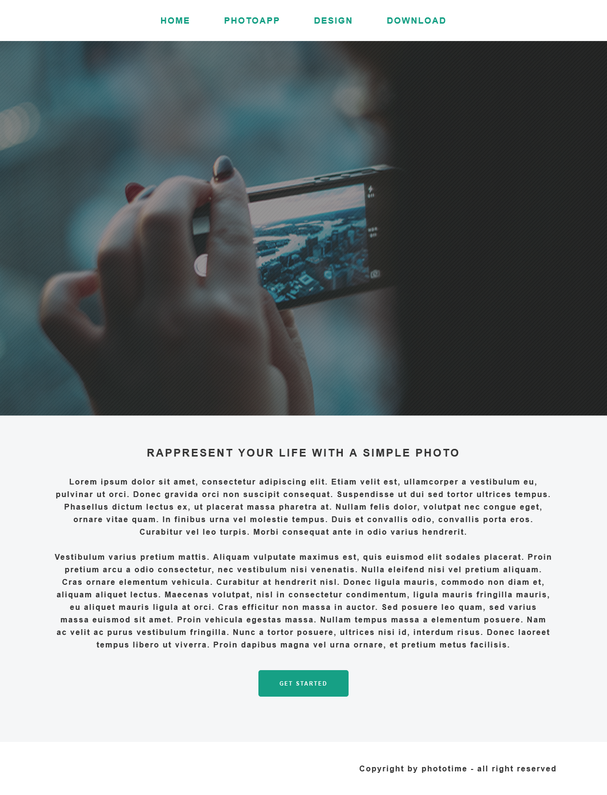

# homework-1

## Завдання

Зверстати макет Simple%20photo.jpg / Simple%20photo.psd
  
Зробити верстку максимально близькою до макету. По можливості повторити розташування елементів, відступи, розмір шрифту, кольору. Зображення можна замінити на своє. Текст для абзаців теж можна взяти будь-який.