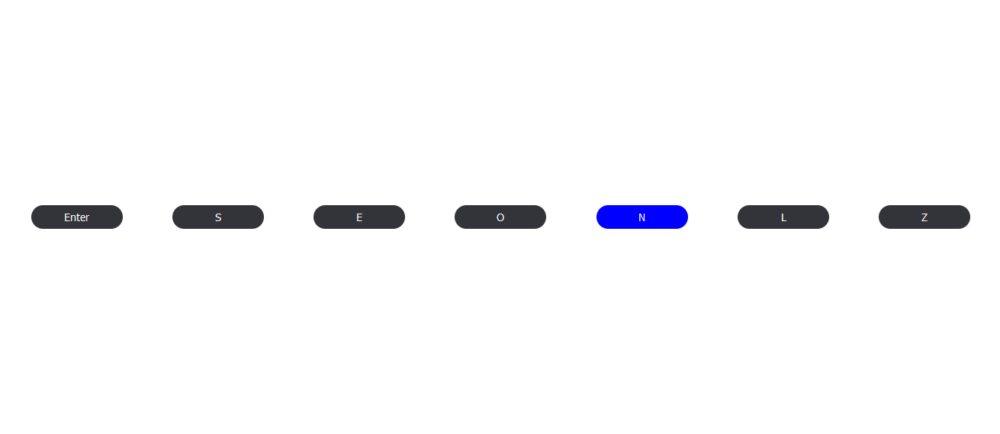

# homework-11

## Завдання

Реалізувати функцію підсвічування клавіш.

## Теоретичне питання

1. Чому не рекомендується використовувати події клавіатури для роботи з input?
     
   Використання подій клавіатури для роботи з введенням (input) не рекомендується, оскільки це може порушити нативний механізм роботи інтерфейсу введення. Браузери вже надають вбудовані механізми обробки введення, такі як фокус, втрату фокусу, натискання клавіш та інші, які працюють оптимально і коректно з різними типами введення.
     
   Використання подій клавіатури без необхідності може призвести до неправильної обробки введення, конфліктів зі стандартними функціями браузера та негативного впливу на доступність та взаємодію з користувачем.