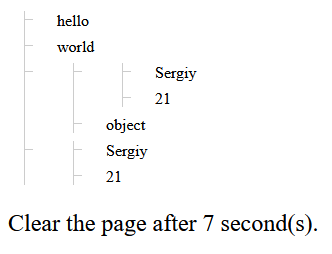

# homework-7

## Завдання

Реалізувати функцію, яка отримуватиме масив елементів і виводитиме їх на сторінку у вигляді списку.

## Теоретичне питання

1. Опишіть своїми словами, як Ви знаєте, що таке Document Object Model (DOM).
     
   Document Object Model (DOM) - це програмний інтерфейс, що представляє структуру HTML або XML документа у вигляді дерева об'єктів. DOM надає можливість змінювати вміст, стиль і атрибути елементів на сторінці веб-додатку. Він дозволяє програмам на JavaScript взаємодіяти з HTML-документом, динамічно змінювати його вміст і структуру, додавати, видаляти або змінювати елементи і відслідковувати події, що відбуваються на сторінці.