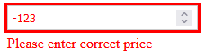
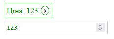
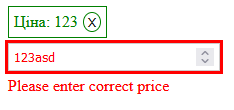

# homework-8

## Завдання

Створити поле для введення ціни з валідацією.

## Теоретичне питання

1. Опишіть своїми словами, як Ви знаєте, що таке обробник подій.
     
   Обробник подій - це функція або шматок коду, який виконується відповідно до спеціальних подій, що відбуваються на веб-сторінці. В HTML, обробники подій можуть бути призначені для різних елементів, таких як кнопки, посилання або поля введення. У CSS, можна використовувати псевдокласи для визначення стилів для елементів в реакції на певні події. В JavaScript, обробники подій дозволяють реагувати на дії користувача, такі як клік, наведення курсору, введення тексту тощо, і виконувати відповідні дії або зміни в сторінці. Обробники подій дозволяють забезпечити взаємодію між користувачем та веб-додатком, надаючи можливість виконувати код у відповідь на різні події, що виникають на сторінці.